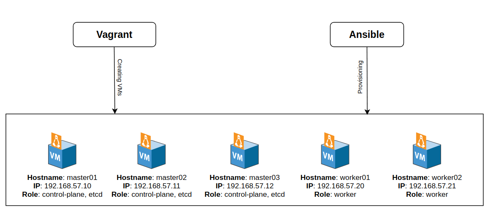
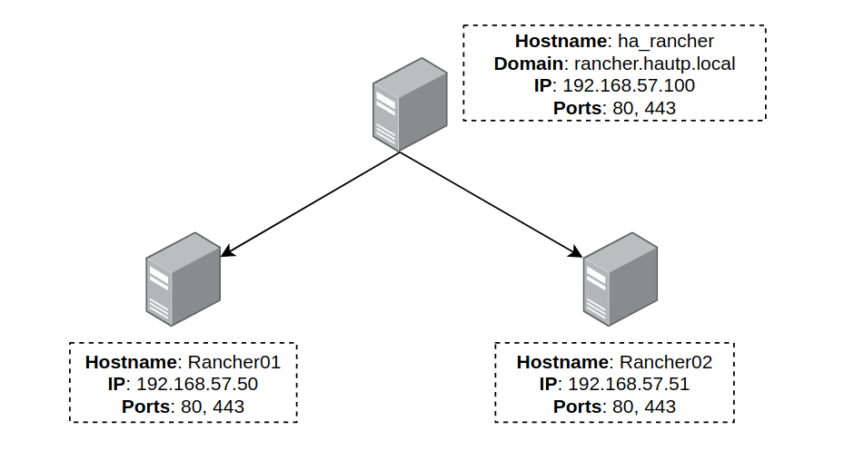
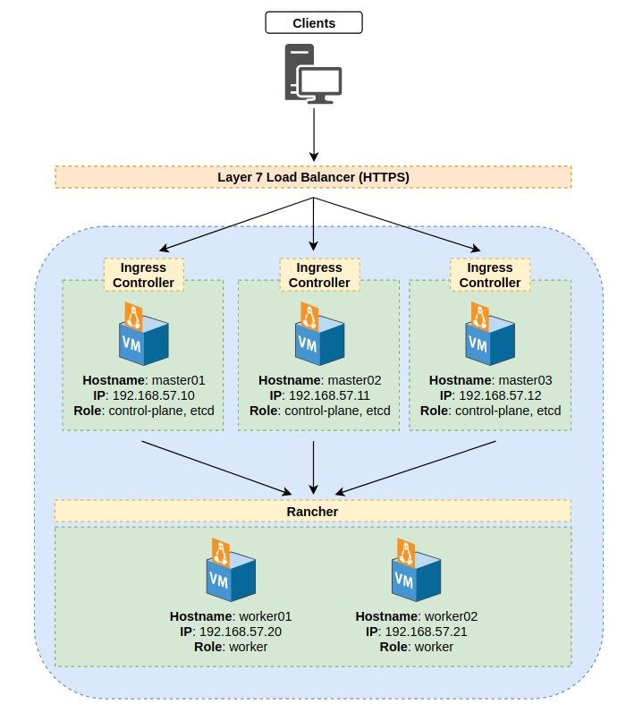
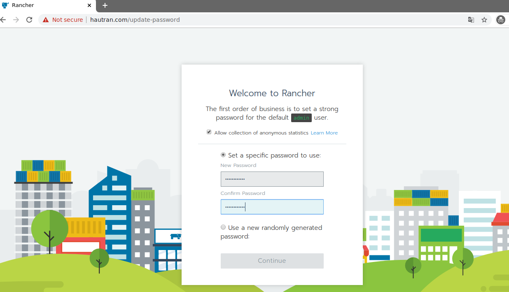
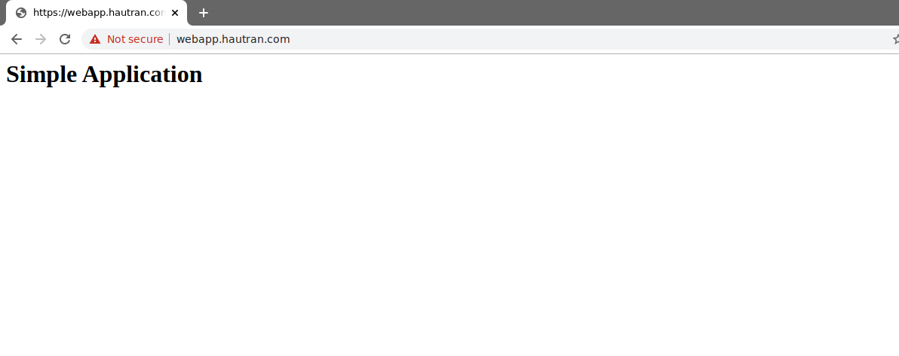

# Labs Rancher
## Indexes
1. [Create droplets and run Ansible bootstrap](https://github.com/hautp/labs-rancher/tree/dev#1-create-droplets-and-run-ansible-bootstrap)

2. [Deploy Rancher HA on single node](https://github.com/hautp/labs-rancher/tree/dev#2-deploy-rancher-ha-on-single-node)

3. [Create custom K8S cluster from RKE and deploy Rancher on K8S](https://github.com/hautp/labs-rancher/tree/dev#3-create-custom-k8s-cluster-from-rke-and-deploy-rancher-on-k8s)

4. [Build and deploy a mini service to k8s cluster](https://github.com/hautp/labs-rancher/tree/dev#4-build-and-deploy-a-mini-service-to-k8s-cluster)

## 1. Create droplets and run Ansible bootstrap
### - Topology
> Note: In this lab, I used `CentOS` like a main OS to install Rancher and Kubernetes.



### - Create droplets and load bootstrap

Using `Vagrant` to create VMs from `Vagrantfile` and `Ansible` will load **initialize_new_droplet.yml** playbook to install necessary software (included **update packages** and install **repository**, **ntp**, **docker**).

```bash
vagrant up
```

The output example:
```
Bringing machine 'master01' up with 'virtualbox' provider...
Bringing machine 'master02' up with 'virtualbox' provider...
Bringing machine 'master03' up with 'virtualbox' provider...
Bringing machine 'worker01' up with 'virtualbox' provider...
Bringing machine 'worker02' up with 'virtualbox' provider...
==> master01: Importing base box 'centos/7'...
==> master01: Matching MAC address for NAT networking...
==> master01: Setting the name of the VM: Rancher_master01_1583083529736_93604
==> master01: Clearing any previously set network interfaces...
...
==> master01: Running provisioner: ansible...
```

You have to wait for a moments to `Vagrant` create VMs and load Ansible bootstrap. 


### - Verify droplets status 
After `Vagrant` ran provisioning, you could verify with below command:

```bash
vagrant status
```

The output example:
```
Current machine states:

master01                  running (virtualbox)
master02                  running (virtualbox)
master03                  running (virtualbox)
worker01                  running (virtualbox)
worker02                  running (virtualbox)
```

## 2. Deploy Rancher HA on single node
### - Topology
 

### - Deploy and run Rancher on nodes using Docker

Login into CentOS host and run installation command below:

+ **Option A: Default Rancher-generated Seft-signed certificate.**

```bash
docker run -d --restart=unless-stopped \
	-p 80:80 -p 443:443 \
	rancher/rancher:latest
```

+ **Option B: Install Rancher with own certificate.**

```bash
docker run -d --restart=unless-stopped \
	-p 80:80 -p 443:443 \
	-v /<CERT_DIRECTORY>/<FULL_CHAIN.pem>:/etc/rancher/ssl/cert.pem \
	-v /<CERT_DIRECTORY>/<PRIVATE_KEY.pem>:/etc/rancher/ssl/key.pem \
	-v /<CERT_DIRECTORY>/<CA_CERTS.pem>:/etc/rancher/ssl/cacerts.pem \
	rancher/rancher:latest
```

- **<CERT_DIRECTORY>** - The path to the directory containing your certificate files. 
- **<FULL_CHAIN.pem>** - The path to your full certificate chain.
- **<PRIVATE_KEY.pem>** - The path to the private key for you certificate.
- **<CA_CERTS>** - The path to the certificate authoriity's certificate.

+ **Option C: Let's Encrypt Certificate**

You must point A record with the hostname that you want to use the Rancher access to the IP of the machine it is running on.

```bash
docker run -d --restart=unless-stopped \
	-p 80:80 -p 443:443 \
	rancher/rancher:latest \
	--acme-domain <YOUR.DNS.NAME>
```

- **<YOUR.DNS.NAME>** - Your domain address

### - Config HA for Rancher by using Nginx (or HAProxy)

> In this lab, I will use Nginx (docker) to HA for 2 Rancher nodes.

- Create `rancher_ha.conf` on node that will be run nginx docker

```bash
vim /opt/rancher_ha.conf
```

```
upstream ha_rancher_http {
    least_conn;
    server 192.168.57.50:80 max_fails=3 fail_timeout=5s;
    server 192.168.57.51:80 max_fails=3 fail_timeout=5s;
}

upstream ha_rancher_https {
    least_conn;
    server 192.168.57.50:443 max_fails=3 fail_timeout=5s;
    server 192.168.57.51:443 max_fails=3 fail_timeout=5s;
}

 server {
    listen 80;
    server_name hautran.com;

    location / {
        proxy_http_version 1.1;
        proxy_set_header Upgrade $http_upgrade;
        proxy_set_header Connection "upgrade";
        proxy_set_header X-Real-IP $remote_addr;
        proxy_set_header X-Forwarded-For $proxy_add_x_forwarded_for;
        proxy_set_header Host $http_host;
        proxy_pass http://ha_rancher_http;
    }
}

server {
    listen 443 ssl;
    server_name hautran.com;
    ssl_certificate /etc/ssl/certs/hautran.com/fullchain.pem;
    ssl_certificate_key /etc/ssl/certs/hautran.com/privkey.pem;

    location / {
        proxy_http_version 1.1;
        proxy_set_header Upgrade $http_upgrade;
        proxy_set_header Connection "upgrade";
        proxy_set_header X-Real-IP $remote_addr;
        proxy_set_header X-Forwarded-For $proxy_add_x_forwarded_for;
        proxy_set_header Host $http_host;
        proxy_pass http://ha_rancher_https;
    }
}
```

- Run `nginx` docker container with custom config
```bash
docker run -d --name ha_rancher \
	--restart=unless-stopped \
	-p 80:80 -p 443:443 \
	-v /opt/rancher_ha.conf:/etc/nginx/conf.d/rancher_ha.conf \
	nginx:latest 
```

## 3. Create custom K8S cluster from RKE and deploy Rancher on K8S
### - Topology


### - Define topology and create K8S cluster by using `rke` command

- **Method 1: You could create empty file `cluster.yml` from `rke` command**
```bash
rke config --empty
```

- **Method 2: Input value into prompt from `rke` command following below step**
```bash
rke config 
```

The output example:
```
[+] Cluster Level SSH Private Key Path [~/.ssh/id_rsa]: ~/.ssh/id_rsa
[+] Number of Hosts [1]: 5
[+] SSH Address of host (1) [none]: 192.168.57.10
[+] SSH Port of host (1) [22]:
[+] SSH Private Key Path of host (192.168.57.10) [none]:
[-] You have entered empty SSH key path, trying fetch from SSH key parameter
...
[+] Add another addon [no]: no
```

Create K8S cluster from `cluster.yml`

```bash
rke up --config cluster.yml
```

You must wait a few moments to `rke` create K8S cluster.

- **Method 3: Using Ansible playbook rke-cluster.yml to install RKE cluster**

View content of `rke-cluster.yml` and define some variables like `rke_k8s_version`, `cluster_name`, ...

```bash
cat provisioning/rke-cluster.yml
```

```yaml
---
- hosts: all
  roles:
    - docker
    - rke-cluster
  vars:
    defined_users:
      - { username: "hautran", rke_ssh_public_key: "{{ playbook_dir }}/public_keys/hautran.pub", rke_ssh_private_key: "{{ playbook_dir }}/private_keys/hautran" }
    # Currently, RKE supported K8S version v1.17.2, v1.16.6, v1.15.9
    rke_k8s_version: "v1.17.2-rancher1-2"
    rke_cluster_name: "hautran.com"
    rke_ingress: "nginx"
```

Provisioning RKE cluster by using `ansible-playbook` command

```bash
ansible-playbook -i inventory/hau.tran rke-cluster.yml
```

Ansible will create `rancher-cluster.yml`, `kube_config_rancher-cluster.yml`, `rancher-cluster.rkestate` on folder `configs`.

### - Verify after RKE build K8S successfully

```bash
export KUBECONFIG=$(pwd)/kube_config_rancher-cluster.yml
```

```bash
kubectl get nodes
```

```
NAME            STATUS   ROLES               AGE     VERSION
192.168.57.10   Ready    controlplane,etcd   11m   v1.17.2
192.168.57.11   Ready    controlplane,etcd   11m   v1.17.2
192.168.57.12   Ready    controlplane,etcd   11m   v1.17.2
192.168.57.20   Ready    worker              11m   v1.17.2
192.168.57.21   Ready    worker              11m   v1.17.2
```

- Check health's pods on K8S cluster
```bash
kubectl get pods --all-namespaces
```

```
NAME                                      READY   STATUS      RESTARTS   AGE
canal-29ppn                               2/2     Running     2          11m
canal-8hpvv                               2/2     Running     2          11m
canal-d82zk                               2/2     Running     2          11m
canal-t5pqq                               2/2     Running     2          11m
canal-t6gk5                               2/2     Running     2          11m
coredns-7c5566588d-b8cv2                  1/1     Running     1          11m
coredns-7c5566588d-fr4j5                  1/1     Running     1          11m
coredns-autoscaler-65bfc8d47d-mgjs9       1/1     Running     1          11m
metrics-server-6b55c64f86-nnlxv           1/1     Running     1          11m
rke-coredns-addon-deploy-job-wp8wg        0/1     Completed   0          11m
rke-ingress-controller-deploy-job-n24z8   0/1     Completed   0          11m
rke-metrics-addon-deploy-job-tp9j7        0/1     Completed   0          11m
rke-network-plugin-deploy-job-wx7bj       0/1     Completed   0          11m
```

### - Deploy Rancher on K8S cluster
- Using `helm` to install `tiller` on K8S

```bash
kubectl -n kube-system create serviceaccount tiller

kubectl create clusterrolebinding tiller \
  --clusterrole=cluster-admin \
  --serviceaccount=kube-system:tiller

helm init --service-account tiller
```

- Verify the installation of `tiller` on cluster

```bash
helm version
```

```
Client: &version.Version{SemVer:"v2.14.3", GitCommit:"0e7f3b6637f7af8fcfddb3d2941fcc7cbebb0085", GitTreeState:"clean"}
Server: &version.Version{SemVer:"v2.14.3", GitCommit:"0e7f3b6637f7af8fcfddb3d2941fcc7cbebb0085", GitTreeState:"clean"}
```

- Add the Helm chart repository

```bash
helm repo add rancher-stable https://releases.rancher.com/server-charts/stable
```

- Install cert-manager

> Note: `cert-manager` is only required for certificates issued by Rancher's generate CA (`ingress.tls.source=rancher`) and Let's Encrypt issued certificates (`ingress.tls.source=letsEncrypt`). 

Install the CustomResourceDefinition resource
```bash
kubectl apply -f https://raw.githubusercontent.com/jetstack/cert-manager/release-0.9/deploy/manifests/00-crds.yaml
```

Create the namespace for `cert-manager`
```bash
kubectl create namespace cert-manager
kubectl label namespace cert-manager certmanager.k8s.io/disable-validation=true
```

Add Helm repository
```bash
helm repo add jetstack https://charts.jetstack.io
```

Update local Helm chart repository
```bash
helm repo update
```

Install `cert-manager`
```bash
helm install \
  --name cert-manager \
  --namespace cert-manager \
  --version v0.9.1 \
  jetstack/cert-manager
```


- Install Rancher from Helm

**Method 1: Using Rancher Generated Certificates**

Set the `hostname` to the DNS name you pointed to your LB.

```bash
helm install rancher-stable/rancher \
  --name rancher \
  --namespace cattle-system \
  --set hostname=hautran.com
```

**Method 2: Using Let's Encrypt**

```bash
helm install rancher-stable/rancher \
  --name rancher \
  --namespace cattle-system \
  --set hostname=hautran.com \
  --set ingress.tls.source=letsEncrypt \
  --set letsEncrypt.email=me@example.org
```

- Verify the installation of Rancher

```bash
kubectl get deployments -n cattle-system
```

```
NAME      READY   UP-TO-DATE   AVAILABLE   AGE
rancher   3/3     3            3           51m
```

```bash
k8 get pods -n cattle-system
```

```
NAME                      READY   STATUS    RESTARTS   AGE
rancher-ddf788bbf-c8vgr   1/1     Running   3          52m
rancher-ddf788bbf-txg8k   1/1     Running   3          52m
rancher-ddf788bbf-x6v74   1/1     Running   5          52m
```

- Login Rancher via web browser



## 4. Build and deploy a mini service to k8s cluster
I have a source code that written by Flask at https://github.com/hautp/simple-app. 
I will use this source code to build docker image following below steps.

- Clone source code from Git

```bash
git clone https://github.com/hautp/simple-app.git
```

- Build image from Dockerfile

```bash
cd simple-app
docker build -t "simple-app" .
```

- Push image to Docker Hub

```bash
docker tag simple_app:latest hautran/simple_app:latest
docker push hautran/simple_app:latest
```

- Preparing deployment, service and ingress files to deploy

```bash
vim deployment.yml
```

```yaml
---
kind: Deployment
apiVersion: apps/v1
metadata:
  name: simple-app-deployment
  namespace: apps
spec:
  replicas: 1
  selector:
    matchLabels:
      app: simple-app
  template:
    metadata:
      labels:
        app: simple-app
    spec:
      containers:
      - name: simple-app
        image: hautran/simple_app:latest
        ports:
        - name: web
          containerPort: 5000
```

```bash
vim service.yml
```

```yaml
---
apiVersion: v1
kind: Service
metadata:
  name: simple-app-svc
  namespace: apps
spec:
  selector:
    app: simple-app
  ports:
  - name: web
    port: 5000
    protocol: TCP
    targetPort: 5000
```

```bash
cat ingress.yml
```

```yaml
---
apiVersion: extensions/v1beta1
kind: Ingress
metadata:
  name: simple-app-ingress
  namespace: apps
  annotations:
    certmanager.k8s.io/issuer: rancher
    nginx.ingress.kubernetes.io/proxy-connect-timeout: "30"
    nginx.ingress.kubernetes.io/proxy-read-timeout: "1800"
    nginx.ingress.kubernetes.io/proxy-send-timeout: "1800"
spec:
  rules:
  - host: webapp.hautran.com
    http:
      paths:
      - backend:
          serviceName: simple-app-svc
          servicePort: 5000
  tls:
  - hosts:
    - webapp.hautran.com
    secretName: tls-rancher-ingress
```

- Deploy to RKE cluster
```bash
kubectl create namespaces apps

kubectl apply -f deployment.yml 
kubectl apply -f service.yml 
kubectl apply -f ingress.yml
```

- Verify the deployment
```bash
kubectl get deployments -n apps
```

```
NAME                    READY   UP-TO-DATE   AVAILABLE   AGE
simple-app-deployment   1/1     1            1           3h6m
```

- Verify the service

```bash
kubectl get svc -n apps
```

```
NAME             TYPE        CLUSTER-IP     EXTERNAL-IP   PORT(S)    AGE
simple-app-svc   ClusterIP   10.43.242.67   <none>        5000/TCP   87m
```

- Verify the ingress
```bash
kubectl get ingresses -n apps
```

```
NAME                 HOSTS                ADDRESS                       PORTS     AGE
simple-app-ingress   webapp.hautran.com   192.168.57.20,192.168.57.21   80, 443   23m
```

- Using web browser to access app
